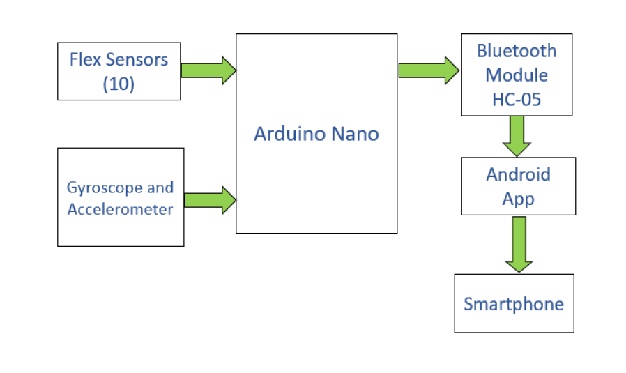

# Transliterating-Gloves
Designed a portable glove which converts sign language into text and audio and helps to break the communication barrier between normal and deaf/dumb people
# ABSTRACT 
There is a huge gap in communication between the deaf or dumb or blind people and normal folks.
Often the method of communicating of the dead/dumb that is with the help of sign languages is
misintrepreted by the normal people and hence the gap in communication. A translator is needed who
can translate the sign languages to the corresponding text/ audio. This project is based on the need
of developing an electronic device that can translate hand gesture or hand signs into text and speech
in order to make the communication between the mute communities with the normal people. A data
glove is used to convey the finger gesture of a mute person. Mute people can use the glove to perform
hand gesture and the same will be converted into text as well as in speech so that normal people can
understand the mute person expression. The glove is equipped with flex sensors, gyroscope and an
accelerometer to measure the flexion of the fingers, to measure tilt and the rotation of the hand. The
data is transmitted from microcontroller to an android app via Bluetooth module which then uses it’s
text to speech converter to convert the incoming text into Audio output as well as display the received
text on its display. These gloves, hence build a bridge for communication between the normal people
and the special ones.
# Introduction
  Sign language is a language which instead of acoustically conveyed sound patterns, uses manual
communication and body language to convey meaning. This can involve simultaneously combining
hand shapes, orientation and movement of the hands, arms or body, and facial expressions to fluidly
express a speaker’s thoughts. Wherever communities of deaf people exist, sign language will be useful.
  Sign language is also used by persons who can hear, but cannot physically speak. While they
utilize space for grammar in a way that spoken languages do not. Sign languages exhibit the same
linguistic properties and use the same language faculty as spoken languages do.
  Hundreds of sign languages are in use around the world and are at the cores of local deaf cultures.
Some sign languages have obtained some form of legal recognition, while others have no status at all.
Deaf and dumb people use sign language to communicate with themselves and with common people.
It is very difficult for the common people to understand this language. Though they can show their
message in writing, it is not conveyable to the illiterate people. Sign language translating equipment
helps in conveying their message to the common people. It translates their message in sign form
to the normal understandable text or voice form. All over the world there are many deaf and dumb
people. They are all facing the problem of communication
  This project is an effort to overcome this communication barrier by developing a glove which
senses the hand movement of the sign language through sensors and translates it into text and voice
output which will enable vocally challenged people to communicate with normal people without any
difficulty.

# Problem Statement
• Communication between deaf-mute and a normal person has always been a challenging task
  which creates very little room for them to communicate effectively.
• Sign language is a non-verbal form of intercourse which is found amongst deaf communities
  in world. The languages do not have a common origin and hence is difficult to interpret.
• Our project has been designed to provide solution to these problems. We are converting sign
  language into text and audio form which will help deaf and dumb people to communicate
  effectively.
• The deaf and dumb person is largely dependent on a family because they get economically and
  emotional support from the family. Our project has been designed to provide solutions to the
  problems faced by the deaf and dumb people in real world.

# Objectives
• To design and develop a system which lowers the communication gap between speech-hearing
	impaired and normal world.
• Build a glove device to detect sign language.
• Maximum utilization of space available on the glove so that all the hardware components can
	fit on it.
• Able to recognize and effectively differentiate between different gestures.
• Device should be as Portable as possible.

# Procedure Adopted
Our system consists of 5 flex sensors on each hand and an accelerometer and gyroscope. These
sensors are used to reduce the power and cost. The flex sensors and the accelerometer and gyroscope
unit, together are used to recohnize the finger and palm gestures. A block diagram of the proposed
system is as shown below,

IMAGE1

The Arduino Nano controller is used to reduce the size of the circuit and it also provides the
required number of input and output pins for the design. Ten flex sensors are used to measure the
angle of bending of fingers. The flex sensors are interfaced with the accelerometer and gyroscope
unit through the microcontroller. All the signals from the sensors are fed to the Arduino. So for
every action the motion sensor gets accelerated and gives the signal to the controller. The Arduino
nano controller matches the input signal wth the already stored, corresponding text and will show the
message on the smartphone screen via the Bluetooth module. The text to speech converter application
will convert the corresponding text messages into speech and audio form.

# Methodology

The Language of Glove uses a similar tracking method to the other glove-based systems. Five
stretchable sensors are attached to the knuckles of a leather athletic glove, one on each finger and
one on the thumb. These are connected to a Ardiuno Nano board on the wrist, which generates a
corresponding meaning of the Sign Language based on the position of the fingers and palm.
The code works off a binary system. The sensors are designed to change their electrical resistance
when they’re bent or stretched, so when a finger is straight, the device registers a 0 input, while a bent
finger sends a signal of 1. The system combines these signals from all five sensors to generate a fivedigit
code, which corresponds with a particular letter. For example, in sign language the letter A is
made by keeping the thumb straight while bending all fingers, so the code is 01111. To differentiate
between similar gestures, the glove is also equipped with a gyroscope sensor. The various steps
involved in the design and making of the project are as below:
• Develop a sensing network that incorporates and differentiates the different types of hand
movement based on flexion, contact, rotation, and lastly translation.
• Interface the sensor network with a microcontroller, Arduino Nano.
• Design a Printed Circuit Board (PCB) that serves as the bridge between our hardware and
software components, thereby allowing hand movements and sensor signals to be input to and
processed by the microcontroller and the software code.
• Develop a program that recognizes sensor signals and stores those that correspond to a designated
sign into a code library.
It should be noted that the objectives can be categorized into two main categories, hardware and
software. Objective 1 is hardware objective, as it relates to the physical, tangible parts of the glove,
while Objective 4 is a software objective and is instead focused on the glove’s code development and
signal processing. Objectives 2 and 3, as they relate to both the hardware andsoftware components,
can be considered embedded systems objectives.

IMAGE2

# Design
In this project, we have studied the basic signs that dumb people use to communicate with each
other. As some of them are not able to talk properly they mostly use signs that are specifically used.
So, it was necessary for us to first understand the sign language used by them which included various
alphabets and few signs which they use in their daily life.Gesture which are the key inputs to our
system, is also studied which gives different output when made different signs depending on the
angle made by fingers and wrist position.
We have measured the different bending resistance values for different angles. A table describing
the same is as below:
IMAGE 3

# Results
We have successfully implemented both hardware and software onto the gloves. An image of the
gloves is as shown:

IMAGE 4

We have measured the resistance values repeatedly, about 5-6 times and thus we have calculated
and tabulated the resistance values in range. We have tabulated results for both, single handed gestures
and also for gestures with two hands. The reason for setting range of resistance values is because
a single gesture cannot have the same bend or the same angle for each and every person. To ensure
that the gesture is interpreted properly we have shown the values in a resistance range.
A table of single handed gestures implemented are as follows:

IMAGE 5

IMAGE 6

# Conclusion
The project proposes a translational device for deaf-mute people using glove technology. The proposed
technique has enabled the placement of ten flex sensor, 5 tactile sensors and an accelerometer
on to a glove. The results demonstrate that sensor glove design with tactile sensor helps to reduce the
ambiguity among gestures and shows improved accuracy. Further the device will be an apt tool for
deafmute community to learn gesture and words easily. The project can be enhanced to include two
or more accelerometers to capture the orientation of hand movements once the gesture is made. This
will expand the capability to translate larger gestures.

# Future Scope
The project can be further developed by creating a wider database and implementing more signs.
Also we can create a unique emergency sign for a user, which will give out signal during times of
distress through the smartphone. The user when performs this particular sign will be read by the
microcontroller as a distress situation and will give out the programmed message and also send a call
or message to the authorities.

